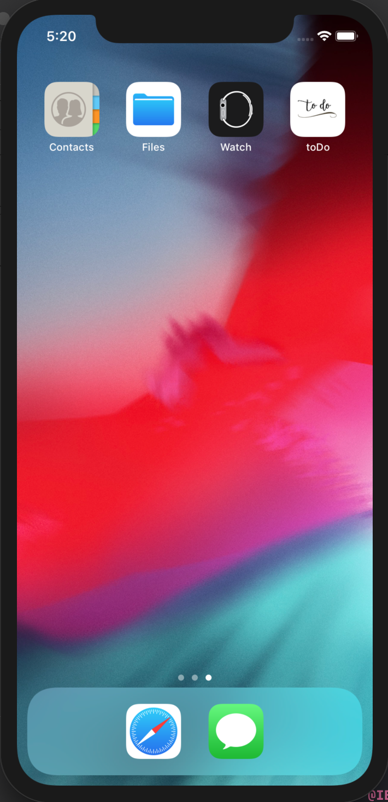
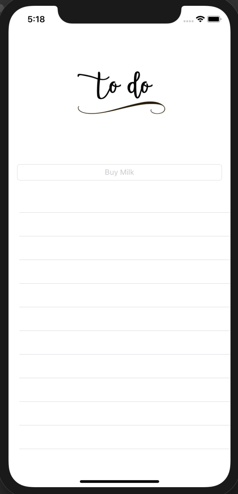

# toDo

This is my first app in Swift where I taught my basics with UI in Xcode as well as general syntax in Swift.  I gained a solid
grasp of the language.  

Within the app, that serves a basic to do list, one can add new tasks, delete, and edit.

