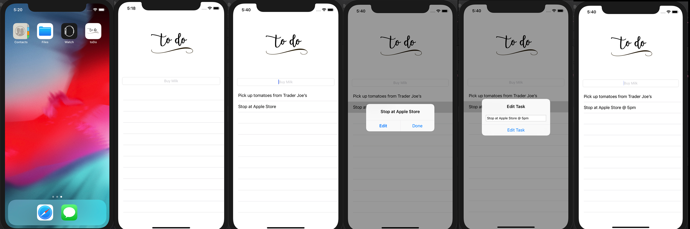

# toDo

This is my first app in Swift where I taught my basics with UI (e.g. working with the storyboard, view controllers, alert controllers) in Xcode as well as general syntax (e.g. let vs var vs optional) in Swift.  I gained a solid
grasp of the language.  

Within the app, that serves a basic to do list, one can add new tasks, delete, and edit.

Note: download to see picture

